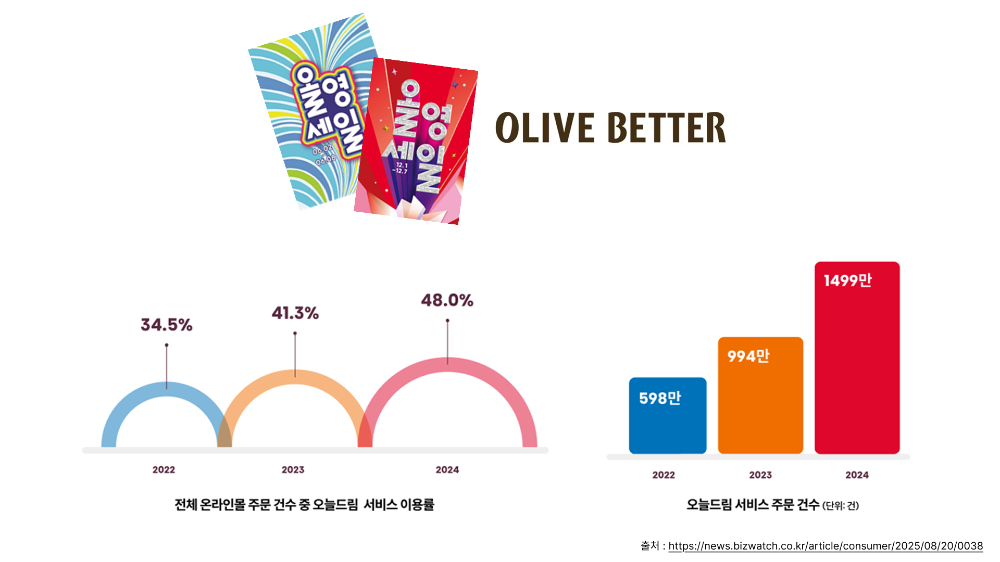
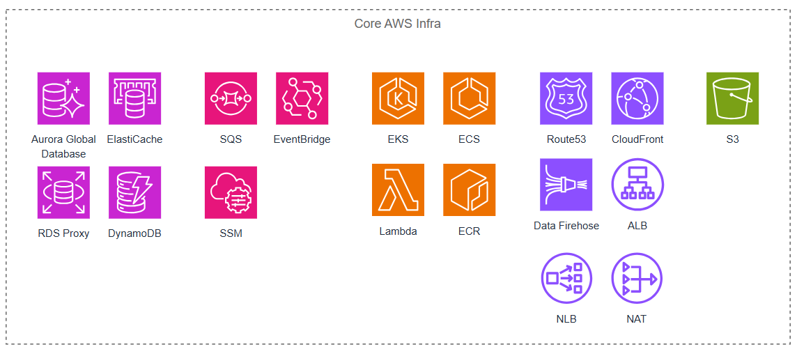
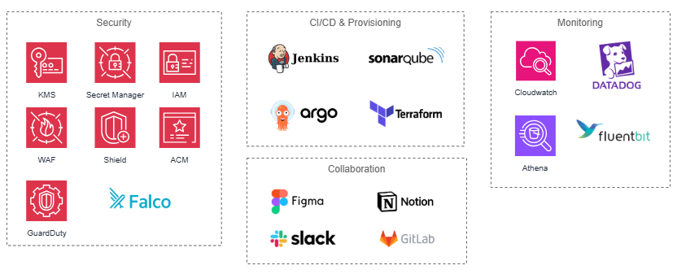
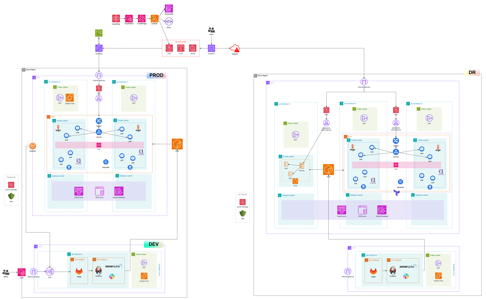
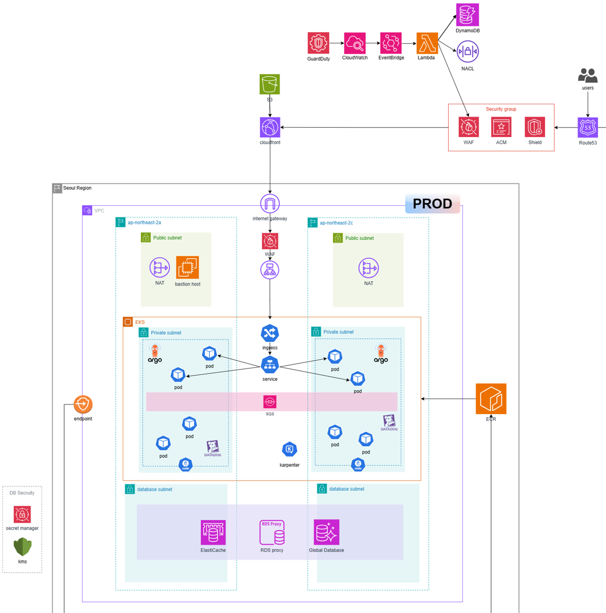
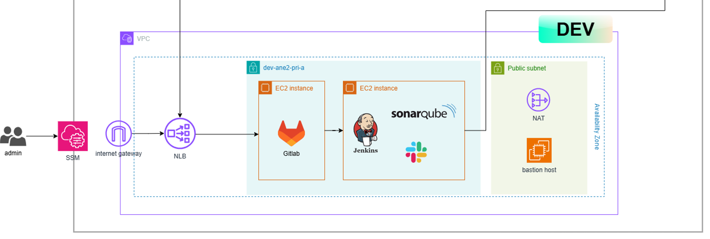
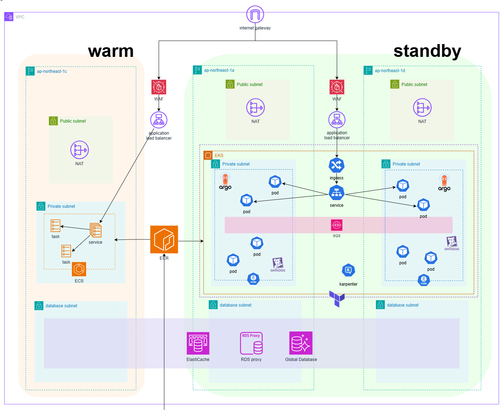
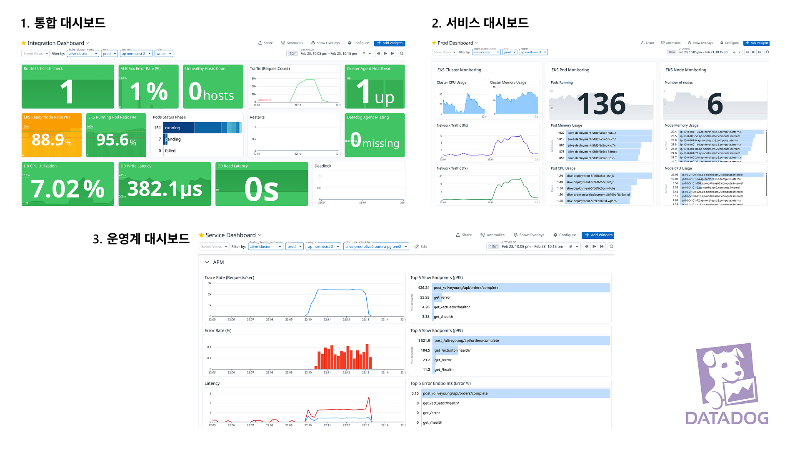
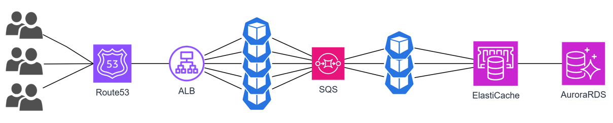
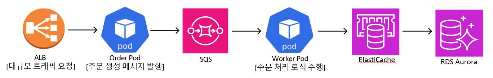

# [CJ Cloud Wave 7기] 올리브영 인프라 구축 프로젝트

 

## 프로젝트 개요

- **프로젝트명** : 올리브영 오늘드림 배송 서비스 주문 폭주 대응 인프라 구축
- **프로젝트 기간** : 26/02/03 ~ 26/02/27
- **프로젝트 선정 배경** :
  
    올리브영 배송 서비스인 오늘드림은 온라인 주문에서 차지하는 비중이 지속적으로 증가하고 있으며, 주문 건수 또한 598만 건에서 1,499만 건으로 크게 성장했습니다. 여기에 ‘올리브베러’ 신규 서비스 출시로 온라인 유입이 더욱 확대되어, 향후 오늘 드림 주문 트래픽이 지속적으로 증가할 것으로 판단했습니다.
   특히 오늘드림 배송은 도착 시간을 기준으로 주문 마감 시간(오후 1시, 오후 8시)이 존재하기 때문에, 해당 시간 직전에 트래픽이 집중될 것으로 예상했습니다. 여기에 분기별로 진행되는 올영 세일 기간까지 고려하여, <b>짧은 시간 동안 급증하는 주문을 안정적으로 처리하는 인프라 구축</b>을 프로젝트 주제로 선정했습니다.

- **프로젝트 목표** :
   실제로 올리브영은 세일 기간 동안 초당 6만 3000건의 요청을 안정적으로 처리한 사례가 있으며, 이는 매우 많은 양의 트래픽입니다.
  특히 행사 기간에는 짧은 시간에 요청이 집중되는 특성이 있어, 정적인 인프라로는 안정적인 대응이 어렵다고 판단했습니다.
   이에, 저희는 피크 상황을 가정하여 구체적인 성능 목표를 설정했습니다.
  원래는 TPS 63,000 수준을 목표로 했지만, 비용과 리소스 제약을 고려하여 약 1/10 수준으로 조정하였습니다.
  결국 저희는 <b>동시 접속자 120만 명과 6,300 TPS를 안정적으로 처리할 수 있는 구조</b>를 목표로 삼았으며, 이를 달성하기 위해 <b>확장성과 고가용성</b>을 중심으로 인프라 아키텍처를 설계했습니다.

 

## 팀 구성원

|                    김연준                     |                   김지민                    |                     김형진                      |                      박동민                       |
| :-------------------------------------------: | :-----------------------------------------: | :---------------------------------------------: | :-----------------------------------------------: |
|  |  |  |  |
|     [kyj2001](https://github.com/kyj2001)     |     [J1miin](https://github.com/J1miin)     |    [pangjin28](https://github.com/pangjin28)    |   [dong-min-ss](https://github.com/dong-min-ss)   |

|                    이연택                     |                    정언준                     |                      현수경                      |
| :-------------------------------------------: | :-------------------------------------------: | :----------------------------------------------: |
|  |  |  |
|     [taekeee](https://github.com/taekeee)     |     [frozzun](https://github.com/frozzun)     |  [hyunsukyung](https://github.com/hyunsukyung)   |

 

## 사용 스택

 

## 전체 아키텍처

 

### 1. 배포계

 

🚛 <b>트래픽흐름</b> : 
Client 요청 → Route53 → CloudFront → Internet Gateway → WAF → ALB → Ingress → ClusterIP service → Order Pod → SQS → Worker Pod → Elasticache/Global Database

 

- 다중 가용영역 구성으로 고가용성 확보
- ArgoCD를 통한 GitOps 배포 구현
- 오토스케일링 전략으로 HPA, KEDA, Karpenter 이용
- PDB, Dummy pod를 통한 node 오토스케일링 안정성 확보
- Cron Job을 통한 스케일링 지연 구간 제거
- SQS 기반 비동기 메시징 아키텍처 적용

 

### 2. 개발계

 

🚛 <b>CI/CD 흐름</b> : 
Admin → GitLab → Jenkins → SonarQube → ECR → manifest 업데이트 → ArgoCD → EKS 배포

 

- VPC 내부에 GitLab 구축을 통한 소스 코드 보안 강화
- Jenkins을 통한 중앙 집중형 파이프라인 제어
- SonarQube로 검증된 코드만 AWS ECR에 이미지로 저장되도록 설계

 

### 3. DR

 

🚛 <b>DR 흐름</b> : 
서울 리전의 서비스 장애 발생 → [Route53 Health check + ALB CloudWatch Alarm] → Global Database failover → Route53 DNS switch

 

- 도쿄 리전 Warm-Standby 구성
- 상시 가동되는 ECS를 통해 즉각적인 대응 체계를 갖추고, 재해 시에만 EKS를 프로비저닝하여 탄력적으로 복구
- ECS Fargate 기반 서버리스 아키텍처
- RTO 9분 이내 서비스 복구 가능

 

### 4. Monitoring

 

- Datadog 사용을 통해 metrics, logs, trace를 한 플랫폼 안에서 제공받음으로써, 이를 통한 장애 대응시간 단축
- 목적별로 통합, 서비스, 운영계 대시보드로 총 3가지 대시보드 구성
- Cloudwatch 사용을 통한 관측 체계 이중화- RUM을 통한 실제 사용자들의 병목 지점 확인
- Slack 알림을 통한 빠른 장애 대응 구축

 
 

# 세부 내용 📑

- [데이터 흐름](#데이터-흐름)
- [대규모 트래픽(6만3000) 처리를 위한 고려 사항](#대규모-트래픽63000-처리를-위한-고려-사항)
- [적절한 리소스 할당을 위한 Goldilocks 도입](#적절한-리소스-할당을-위한-goldilocks-도입)
- [재고 동시성 제어 및 DB 부하 감소를 위한 ElastiCache 도입 (Write-Behind)](#재고-동시성-제어-및-db-부하-감소를-위한-elasticache-도입-write-behind)
- [트래픽 처리를 위한 SQS 도입](#트래픽-처리를-위한-sqs-도입)
- [HPA 및 KEDA 기반 Pod Auto-Scaling](#hpa-및-keda-기반-pod-auto-scaling)

## 데이터 흐름

<b>1. 주문 요청 시작</b>

- 사용자가 주문 버튼 클릭

<b>2. 트래픽 진입</b>

- 사용자 요청이 Route53을 통해 DNS 라우팅된 뒤, ALB를 거쳐 EKS 클러스터로 전달

<b>3. 주문 API 처리</b>

- EKS에 배포된 Order Pod가 요청을 수신
- 요청 데이터 검증 수행

<b>4. 메시지 큐 적재</b>

- 검증 완료 후 주문 요청을 SQS에 메시지로 적재
- 사용자 요청에 대한 빠른 응답 반환

<b>5. 비동기 주문 처리</b>

- Worker Pod가 SQS에서 메시지를 수신

<b>6. 재고 선점 처리</b>

- Worker Pod가 ElastiCache에서 재고를 선점하여 동시성 제어 수행

<b>7. 주문 최종 반영</b>

- 재고 선점 성공 시 주문 데이터를 데이터베이스(RDS)에 최종 저장

 

## 대규모 트래픽(6만3000) 처리를 위한 고려 사항

- 6,300 TPS를 처리하기 위한 CPU 및 메모리 스펙을 통한 63,000 TPS를 위한 스펙 예측
- k8s pod 및 node 오토 스케일

 

## 적절한 리소스 할당을 위한 Goldilocks 도입

- <b>도입 배경</b> : Pod의 CPU와 메모리를 과도하게 설정하면 클러스터 리소스가 낭비되고, 반대로 너무 낮게 설정하면 트래픽 증가 시 성능 저하나 Pod 재시작이 발생할 수 있음. 따라서 실제 사용량 기반으로 적절한 리소스 요청(Request) 값을 산정할 필요가 있음.
- <b>해결 방안</b> : Kubernetes 리소스 권장 도구인 Goldilocks를 도입하여 Pod의 CPU와 메모리 사용량을 분석하고 최적의 리소스 요청값을 도출.
- <b>적용 방식</b> : Goldilocks가 제공하는 권장 리소스 값을 참고하여 Pod의 requests와 limits 값을 설정. 이를 통해 리소스 낭비를 줄이면서도 트래픽 증가 시 안정적으로 동작할 수 있는 효율적인 Pod 스펙을 구성.

 

## 재고 동시성 제어 및 DB 부하 감소를 위한 ElastiCache 도입 (Write-Behind)

- <b>도입 배경</b> : 대규모 트래픽 상황에서 모든 주문 요청이 직접 데이터베이스의 재고를 수정하면
  락 경쟁과 쓰기 부하가 급격히 증가하여 성능 저하나 장애가 발생할 수 있음. 특히 행사 시간대에는 동시에 많은 주문이 발생하기 때문에 재고를 빠르게 제어하면서도 데이터베이스 부하를 줄일 수 있는 구조가 필요.
- <b>해결 방안</b> : ElastiCache를 활용해 재고 정보를 메모리 기반으로 관리하도록 설계. 주문 요청이 들어오면 먼저 ElastiCache에서 재고를 선점하여 동시성 제어를 수행하고, 이후 Worker가 주문 데이터를 데이터베이스에 반영하는 구조로 구성. 이를 통해 데이터베이스에 직접 발생하는 쓰기 트래픽을 줄이고 빠른 응답 속도를 확보.
- <b>데이터 처리 방식 (Write-Behind)</b> : 주문 처리 시 먼저 ElastiCache에서 재고를 차감하여 즉시 상태를 반영하고, 이후 Worker가 주문 데이터를 데이터베이스에 비동기로 저장. 즉, 캐시에 먼저 쓰고 이후 데이터베이스에 반영하는 Write-Behind 전략을 사용하여 실시간 재고 제어와 데이터 영속성을 동시에 확보.

 

## 트래픽 처리를 위한 SQS 도입

- <b>도입 배경</b> : 올영세일과 같은 이벤트 시간에는 짧은 시간 동안 주문 요청이 집중되어 애플리케이션과 데이터베이스에 순간적인 부하가 발생할 수 있음. 이로 인해 요청 처리 지연이나 장애가 발생할 가능성이 있기 때문에 주문 요청을 안정적으로 흡수할 수 있는 구조가 필요.
- <b>해결 방안</b> : 주문 API와 실제 주문 처리 로직을 분리하기 위해 Amazon SQS를 도입. API 서버는 주문 요청을 직접 처리하지 않고 메시지 큐에 적재하여 빠르게 응답하고, Worker Pod가 큐에 쌓인 메시지를 순차적으로 처리하도록 비동기 아키텍처를 구성. 이를 통해 트래픽이 급증하더라도 요청을 안정적으로 버퍼링하고 시스템 부하를 분산.
- <b>메시지 처리 방식</b> : Producer 역할을 하는 Order Pod가 주문 요청을 SQS에 메시지로 전송하고, Consumer 역할을 하는 Worker Pod가 메시지를 수신하여 주문 처리 로직을 수행. Worker Pod는 메시지를 처리하면서 ElastiCache에서 재고를 선점한 뒤, 최종 주문 상태를 데이터베이스에 반영.

 

## HPA 및 KEDA 기반 Pod Auto-Scaling

- <b>도입 배경</b> : 주문 처리 과정에서 Order Pod(API 서버)와 Worker Pod의 부하 패턴이 서로 달랐음. 주문 요청(주문 API)을 처리하는 Order Pod는 HTTP 요청 수 증가에 따라 부하가 증가하게 되고, 주문 후 처리 작업을 수행하는 Worker Pod는 SQS에 적재된 메세지 수에 따라 부하가 증가하게 됨.
  이때, Worker Pod의 부하는 CPU 기반 Auto-Scaling(HPA)만으로는 실제 처리해야 할 작업량을 정확하게 반영하기 어려움.
  따라서 동기 요청 처리와 비동기 작업 처리의 특성을 고려한 별도의 Scaling 전략이 필요했음.
- <b>해결 방안</b> : 워크로드의 특성에 맞춰 2가지 Auto-Scaling 전략을 분리 적용함.
  - HPA (Horizontal Pod Autoscaler)  
    → Order API Pod 스케일링 (CPU 기반)
  - KEDA (Kubernetes Event-driven Autoscaling)  
    → Worker Pod 스케일링 (SQS Queue Length 기반)
    이를 통해 동기 요청 처리와 비동기 작업 처리의 확장 전략을 분리할 수 있었음.
- <b>처리 방식</b> :
  - HPA : 사용자 요청 증가에 따라 CPU 사용량이 증가하면, HPA가 이를 감지하여 Order Pod를 자동으로 확장함.
  - KEDA : Order Pod가 주문 요청을 처리한 뒤 작업 메세지를 SQS에 적재. KEDA는 Queue Length를 주기적으로 모니터링하여, 메세지가 일정 수준 이상 쌓이면 Worker Pod를 자동으로 확장.

 
